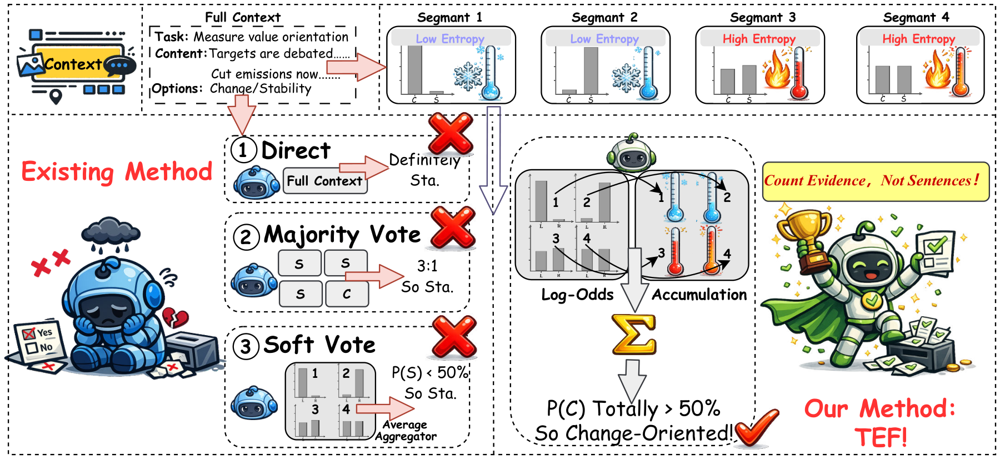
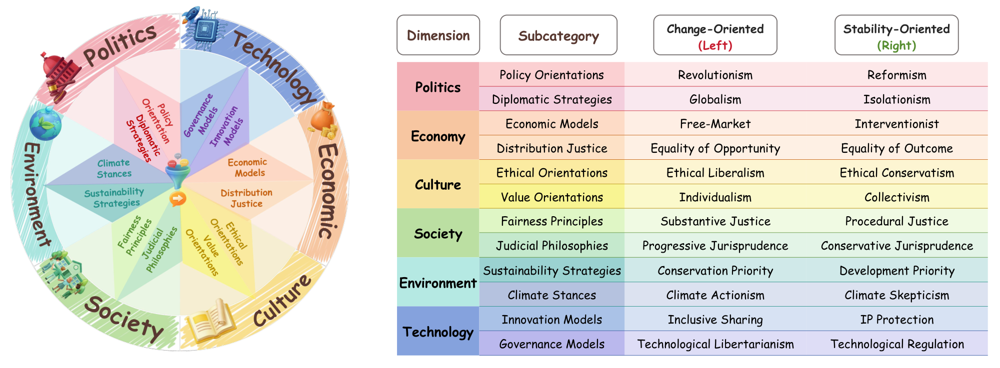
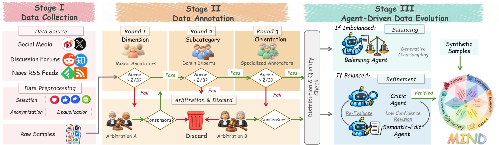
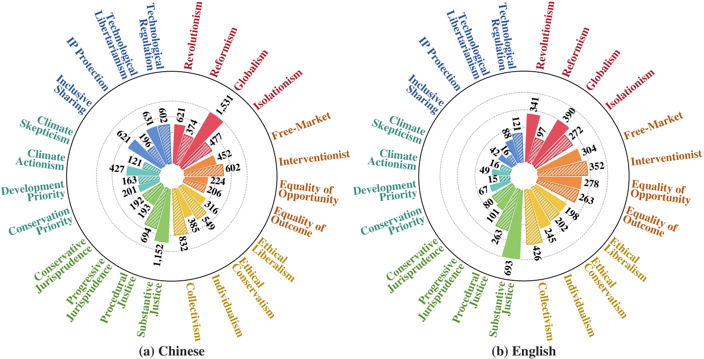
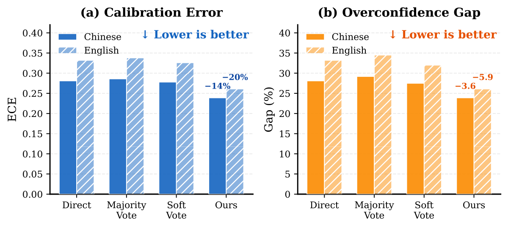

<div align="center">


# TEF

### Count Evidence, Not Sentences

<em>Tempered Evidence Fusion of LLM Judgments for Long-Text Value Measurement</em>

<br>

Yuhe Wu<sup>1,&#42;</sup>, Rui Qian<sup>2,&#42;</sup>, Guangyu Wang<sup>1,&#42;</sup>, Yuran Chen<sup>3</sup>, Yuanchao Zhu<sup>4</sup>, Junjie Yang<sup>5</sup>,<br>
Zhengheng Li<sup>6</sup>, Jiulin Cai<sup>7</sup>, Tianyi Zhang<sup>8</sup>, Zihan Dong<sup>9</sup>, Jiaxin Liu<sup>1</sup>, Yujie Chen<sup>10</sup>, Guang Zhang<sup>1,†</sup>

<sup>1</sup><a href="https://www.hkust-gz.edu.cn/">HKUST(GZ)</a> &nbsp;
<sup>2</sup><a href="https://www.fudan.edu.cn/">FDU</a> &nbsp;
<sup>3</sup><a href="https://www.dufe.edu.cn/">DUFE</a> &nbsp;
<sup>4</sup><a href="https://www.uestc.edu.cn/">UESTC</a> &nbsp;
<sup>5</sup><a href="https://umd.edu/">UMD</a> &nbsp;
<sup>6</sup><a href="https://www.seu.edu.cn/">SEU</a> &nbsp;
<sup>7</sup><a href="https://www.ustc.edu.cn/">USTC</a> &nbsp;
<sup>8</sup>Independent &nbsp;
<sup>9</sup><a href="https://www.gatech.edu/">Georgia Tech</a> &nbsp;
<sup>10</sup><a href="https://www.cuhk.edu.cn/">CUHK(SZ)</a>

<sup>&#42;</sup>Equal contribution &nbsp;&nbsp; <sup>†</sup>Corresponding author<br>
<a href="mailto:yuhewu@hkust-gz.edu.cn">yuhewu@hkust-gz.edu.cn</a> · <a href="mailto:guangzhang@hkust-gz.edu.cn">guangzhang@hkust-gz.edu.cn</a> · <a href="mailto:qiianruii@gmail.com">qiianruii@gmail.com</a>

<br>

[](https://arxiv.org/abs/2609.27165)
[](data/README.md)
[](pyproject.toml)
[](LICENSE)
[](https://creativecommons.org/licenses/by-nc/4.0/)

<br>

<table align="center">
  <tr>
    <td align="center" width="140"><h3>8,358</h3><sub>posts in MIND</sub></td>
    <td align="center" width="140"><h3>6</h3><sub>value dimensions</sub></td>
    <td align="center" width="140"><h3>2</h3><sub>languages (ZH · EN)</sub></td>
    <td align="center" width="140"><h3>5</h3><sub>LLMs evaluated</sub></td>
    <td align="center" width="140"><h3>+4.5 / +4.6</h3><sub>Acc / F1 gain over the best baseline</sub></td>
  </tr>
</table>

</div>

> **TL;DR.** Long social media posts contain only a few stance-bearing sentences. **TEF** fuses sentence-level LLM
> probabilities by summing their log-odds weighted by normalized information gain, so uncertain sentences contribute
> almost nothing while decisive sentences keep a contribution close to the Bayes-optimal log-odds. TEF is training-free,
> uses the same single-token queries as voting, and outperforms the strongest of Direct, Majority Vote, and Soft Vote by
> **4.5 accuracy** and **4.6 macro-F1** points on average across five LLMs and two languages on our benchmark **MIND**.

## 📰 News

- **2026-09** — The preprint is on [arXiv](https://arxiv.org/abs/2609.27165).
- **2026-09** — Code, prompts, and the MIND benchmark (8,358 Chinese and English posts) are released in this repository.

## 🧭 Contents

- [Overview](#-overview)
- [Method: Tempered Evidence Fusion](#-method-tempered-evidence-fusion)
- [The MIND Benchmark](#%EF%B8%8F-the-mind-benchmark)
- [Installation](#-installation)
- [Configuration](#%EF%B8%8F-configuration)
- [Reproducing the Experiments](#%EF%B8%8F-reproducing-the-experiments)
- [Prompts](#-prompts)
- [Results](#-results)
- [Repository Structure](#-repository-structure)
- [Citation](#%EF%B8%8F-citation)
- [License](#-license)
- [Contact](#-contact)

## 🔍 Overview

<p align="center">
  
</p>

Long-text value measurement requires counting informative evidence rather than treating all sentences equally.
**Left:** direct prediction collapses mixed content into one label, while voting can let many uncertain sentences outweigh
a few decisive ones. **Right:** TEF weights sentence log-odds by normalized information gain, discounting uncertain judgments
so decisive evidence drives the document-level orientation.

| | Direct | Majority / Soft Vote | **TEF** |
|:--|:--|:--|:--|
| Unit of judgment | whole post | each sentence | each sentence |
| How sentences combine | — | one vote each, equal weight | log-odds weighted by information gain |
| Uncertain sentences | dilute the single label | count as much as decisive ones | are tempered towards zero |
| Extra training or queries | none | none | none |

<details>
<summary><b>Abstract</b></summary>

<br>

Large language models (LLMs) are increasingly used to measure public value orientations from long social media posts, yet
such posts often mix background, quotations, concessions, and only a few stance-bearing sentences. Existing approaches either
ask the model to predict a document-level label directly, which can be overconfident, or aggregate sentence-level predictions
by majority or soft voting, which treat uncertain and decisive sentences as equally informative. We formulate long-text value
measurement as a decision-fusion problem and propose Tempered Evidence Fusion (TEF), a training-free rule that weights each
sentence's log-odds by its normalized information gain, as derived from a generalized Bayesian posterior. This makes the fused
score nearly vanish for uncertain sentences while preserving the Bayes-optimal weight of decisive evidence. We further introduce
Multi-event Insight Network Dimensions (MIND), a benchmark of 8,358 Chinese and English posts spanning five years of public
events and six value dimensions. On MIND, TEF outperforms the strongest baseline among Direct, Majority Vote, and Soft Vote by an
average of 4.5 accuracy points and 4.6 macro-F1 points across five LLMs and two languages.

</details>

## 🧮 Method: Tempered Evidence Fusion

A post $X$ is segmented into sentences $D_1,\ldots,D_N$. For a value dimension with categories
$\mathcal{Y}=\lbrace c_1,\ldots,c_K\rbrace$ (here $K=2$: change-oriented and stability-oriented), the LLM returns a
distribution $\mathbf{p}_i$ over $\mathcal{Y}$ for each sentence, read from the answer-token log-probabilities.
TEF weights each sentence by its normalized information gain and sums clipped log-odds:

$$
w_i = 1-\frac{H(\mathbf{p}_i)}{\log K},\qquad
\mathrm{Score}(c)=\sum_{i=1}^{N} w_i\,\mathrm{clip}\left(\log\frac{\tilde{p}_i^{(c)}}{1-\tilde{p}_i^{(c)}},-M,M\right),\qquad
\hat{Y}=\arg\max_{c\in\mathcal{Y}}\mathrm{Score}(c),
$$

where $\tilde{p}=\mathrm{clip}(p,\epsilon,1-\epsilon)$, $\epsilon=10^{-6}$, and $M=10$. A near-uniform sentence has
$w_i\approx 0$ and is softly censored; a decisive sentence has $w_i\approx 1$ and contributes its log-odds, which is the
additive statistic of Bayesian pooling under conditionally independent, calibrated sentence posteriors.

| Rule | Contribution of sentence $i$ | Function |
|:--|:--|:--|
| Direct | one query on the whole post, no segmentation | `tef.direct` |
| Majority Vote | hard label $\arg\max_k p_i^{(k)}$ | `tef.majority_vote` |
| Soft Vote | probability $p_i^{(c)}$ with equal weight | `tef.soft_vote` |
| **TEF** | $w_i$ times clipped log-odds | `tef.tef` |
| w/o Entropy (ablation) | clipped log-odds with $w_i=1$ | `tef.tef_without_entropy` |
| w/o Log-Odds (ablation) | $w_i$-weighted average of probabilities | `tef.tef_without_log_odds` |

```python
from tef import majority_vote, soft_vote, tef

# P(change-oriented) for five sentences: one decisive, four uncertain
p = [0.9, 0.35, 0.35, 0.35, 0.35]
majority_vote(p).prediction  # 'stability'
soft_vote(p).prediction      # 'stability'
tef(p).prediction            # 'change'
tef(p).confidence            # softmax of the two scores at temperature 5
```

## 🗂️ The MIND Benchmark

MIND (**M**ulti-event **I**nsight **N**etwork **D**imensions) contains **8,358 posts** (5,474 Chinese, 2,884 English)
collected from X, Weibo, Reddit, Zhihu, discussion forums, and news feeds between January 2020 and January 2025.
Posts are annotated over six value dimensions. Each dimension has two subcategories, and every subcategory contrasts a
change-oriented (left) position with a stability-oriented (right) position.

<p align="center">
  
</p>

MIND is built in three stages: data collection, three-round annotation (dimension, subcategory, orientation; three annotators
per round with a two-of-three agreement rule and arbitration), and agent-driven data evolution for class balance and
semantic clarity.

<p align="center">
  
</p>

<p align="center">
  
</p>

Radial bars report the number of labels for each value orientation in (a) Chinese and (b) English posts.

| | Chinese | English |
|:--|--:|--:|
| Posts | 5,474 | 2,884 |
| Subcategory labels | 11,762 | 4,919 |
| Evaluation pairs (post, dimension) | 10,330 | 4,621 |
| Mean post length | 138.2 characters | 86.8 words |
| Mean sentences per post | 4.35 | 5.84 |

The record format, the evaluation unit, per-dimension statistics, and the license are described in the
[data card](data/README.md). A record looks like this:

```json
{"id": "en-single-9", "lang": "en", "event": "COL", "text": "...",
 "labels": [{"dimension": "Economy", "subcategory": "Economic Models", "orientation": "Interventionist", "side": "stability"}]}
```

## 🚀 Installation

```bash
git clone https://github.com/Kzczc/ICASSP2027-TEF.git
cd ICASSP2027-TEF
conda create -n tef python=3.10 -y
conda activate tef
pip install -r requirements.txt
pip install vllm   # only for local open-source models; install the build that matches your CUDA version
pytest -q          # unit tests; no GPU or API key required
```

## ⚙️ Configuration

`configs/models.yaml` defines the five models of the paper and reads paths and keys from environment variables
written as `${NAME}` or `${NAME:-default}`.

```bash
cp .env.example .env              # fill in keys and paths; .env is ignored by git
set -a && source .env && set +a   # export the variables to the current shell
```

| Variable | Purpose | Example |
|:--|:--|:--|
| `MIND_DATA_DIR` | Directory with `mind_zh.jsonl` and `mind_en.jsonl` | empty (uses `./data`) |
| `QWEN25_7B_PATH` | Qwen2.5-7B-Instruct weights | `Qwen/Qwen2.5-7B-Instruct` or `/data/models/Qwen2.5-7B-Instruct` |
| `LLAMA3_8B_PATH` | Meta-Llama-3-8B-Instruct weights | `meta-llama/Meta-Llama-3-8B-Instruct` |
| `QWEN3_14B_PATH` | Qwen3-14B weights (thinking mode disabled) | `Qwen/Qwen3-14B` |
| `QWEN25_7B_TP`, `LLAMA3_8B_TP`, `QWEN3_14B_TP` | Tensor-parallel size (GPUs per model) | `1`, `1`, `2` |
| `DEEPSEEK_API_KEY` | Key for DeepSeek-V3.2 | `sk-...` |
| `DEEPSEEK_BASE_URL`, `DEEPSEEK_MODEL` | DeepSeek endpoint and model name | `https://api.deepseek.com`, `deepseek-chat` |
| `OPENAI_API_KEY` | Key for GPT-4o-mini | `sk-...` |
| `OPENAI_BASE_URL` | OpenAI-compatible endpoint; empty for the official API | empty |
| `VLLM_BASE_URL`, `VLLM_API_KEY` | vLLM server used by `scripts/efficiency.py` | `http://localhost:8000/v1`, `EMPTY` |

> [!NOTE]
> The repository contains no API key, model path, or machine-specific path; everything lives in your `.env`.
> In the paper, the open-source models are served on RTX 3090 GPUs.

## ▶️ Reproducing the Experiments

Every script accepts `--help`. Reports are written as Markdown tables, with the raw numbers in a JSON file next to them.

**1. Inference.** For each (post, dimension) pair, `infer.py` queries the model once on the whole post (Direct) and once per
sentence (Majority Vote, Soft Vote, TEF, and the ablations), using one prompt per language that names the dimension and its
two positions and requests a single answer token. Answer-token log-probabilities are read with greedy decoding and one output
token, without sampling.

```bash
for model in qwen2.5-7b llama3-8b qwen3-14b deepseek-v3.2 gpt-4o-mini; do
  python scripts/infer.py --model "$model" --lang zh en --prompt original
done
```

Probabilities are cached in `outputs/<model>/<prompt>/<lang>.jsonl`, one line per pair with the fields `post_id`, `lang`,
`dimension`, `side`, `direct` (document-level P(change)), and `sentences` (sentence-level P(change)). An interrupted run
resumes from the cache; `--limit 20` runs a quick check. All fusion rules are computed from the cache without further calls.

**2. Main results** (Direct, Majority Vote, Soft Vote, and TEF; accuracy and macro-F1 per dimension):

```bash
python scripts/evaluate.py --report reports/main_results.md
```

**3. Ablation** (w/o Entropy and w/o Log-Odds on Qwen2.5-7B and DeepSeek-V3.2):

```bash
python scripts/ablation.py --models qwen2.5-7b deepseek-v3.2 --report reports/ablation.md
```

**4. Calibration** (expected calibration error with 10 equal-width bins and overconfidence gap on Qwen2.5-7B). Confidence is
the model probability for Direct, the vote share for Majority Vote, the mean probability for Soft Vote, and the softmax of the
two TEF scores at temperature 5 for TEF.

```bash
python scripts/calibration.py --models qwen2.5-7b --report reports/calibration.md --plot reports/calibration.pdf
```

**5. Prompt robustness** (original, verbose, and minimal prompts):

```bash
for prompt in verbose minimal; do
  for model in qwen2.5-7b llama3-8b qwen3-14b deepseek-v3.2 gpt-4o-mini; do
    python scripts/infer.py --model "$model" --prompt "$prompt"
  done
done
python scripts/prompt_robustness.py --report reports/prompt_robustness.md
```

**6. Efficiency** (tokens, time to first token, and cost). TTFT is measured on the client with streaming requests against an
OpenAI-compatible endpoint, so local models are served with `vllm serve` first:

```bash
vllm serve "$QWEN25_7B_PATH" --served-model-name Qwen2.5-7B-Instruct --port 8000 --max-model-len 4096
python scripts/efficiency.py --model qwen2.5-7b-server --gpu-price-per-hour <USD per GPU hour> \
    --report reports/efficiency_qwen2.5-7b.md
```

> [!TIP]
> For API models, pass token prices instead, e.g.
> `python scripts/efficiency.py --model deepseek-v3.2 --price-input <USD per 1M tokens> --price-output <USD per 1M tokens>`.

## 💬 Prompts

All prompts are defined in [`tef/prompts.py`](tef/prompts.py) for Chinese and English. `original` is used in all main
experiments; `verbose` adds role background and annotation guidelines; `minimal` keeps only the classification directive.
All three request the same single answer token, `C` (change-oriented) or `S` (stability-oriented). The same prompt is used
for a whole post (Direct) and for a single sentence (sentence-level rules).

<details>
<summary><b>English prompt (original)</b></summary>

```text
You are a careful annotator who measures public value orientations in social media text.

Decide which position the text supports on the given value dimension.

Dimension: {dimension}
C (change-oriented): {change}
S (stability-oriented): {stability}

Text: {text}

Answer with a single letter, C or S.
Answer:
```

For Economy, `{change}` is `Free-Market (Economic Models); Equality of Opportunity (Distribution Justice)` and `{stability}`
is `Interventionist (Economic Models); Equality of Outcome (Distribution Justice)`.

</details>

<details>
<summary><b>Chinese prompt (original)</b></summary>

```text
你是一名严谨的标注员，负责测量社交媒体文本中的公共价值取向。

请判断文本在给定价值维度上支持哪一种立场。

维度：{dimension}
C（变革取向）：{change}
S（稳定取向）：{stability}

文本：{text}

只回答一个字母：C 或 S。
答案：
```

For 经济, `{change}` is `市场自由（经济模式）；机会平等（分配正义）` and `{stability}` is `国家干预（经济模式）；结果平等（分配正义）`.

</details>

## 🏆 Results

The tables below reproduce the results reported in the paper. Acc and F1 denote accuracy and macro-F1 in percent.
Cul., Eco., Soc., Pol., Tech., and Env. denote culture, economy, society, politics, technology, and environment.
MV and SV denote Majority Vote and Soft Vote. For each model and column, the best method is in bold.

**At a glance — mean over the six dimensions (Acc / F1)**

*Chinese*

| Model | Direct | Majority Vote | Soft Vote | **TEF (Ours)** | Δ vs. best baseline |
|:--|:--:|:--:|:--:|:--:|:--:|
| Qwen2.5-7B | 62.2 / 60.7 | 56.9 / 55.9 | 57.9 / 56.7 | **71.3 / 68.1** | +9.0 / +7.4 |
| LLaMA3-8B | 64.3 / 61.0 | 60.4 / 57.8 | 62.3 / 59.6 | **66.7 / 64.1** | +2.4 / +3.2 |
| Qwen3-14B | 70.4 / 68.1 | 68.4 / 65.1 | 70.3 / 67.8 | **71.9 / 69.3** | +1.4 / +1.2 |
| DeepSeek-V3.2 | 68.4 / 66.0 | 67.1 / 65.5 | 68.4 / 66.6 | **70.9 / 68.7** | +2.5 / +2.2 |
| GPT-4o-mini | 69.0 / 63.7 | 68.2 / 63.0 | 69.2 / 63.8 | **71.2 / 68.5** | +2.0 / +4.6 |

*English*

| Model | Direct | Majority Vote | Soft Vote | **TEF (Ours)** | Δ vs. best baseline |
|:--|:--:|:--:|:--:|:--:|:--:|
| Qwen2.5-7B | 60.8 / 57.4 | 54.8 / 51.0 | 55.4 / 52.1 | **69.1 / 65.0** | +8.3 / +7.6 |
| LLaMA3-8B | 57.2 / 52.7 | 53.8 / 49.4 | 53.8 / 49.0 | **67.3 / 63.3** | +10.1 / +10.6 |
| Qwen3-14B | 63.9 / 56.5 | 63.6 / 58.2 | 63.7 / 57.8 | **65.0 / 59.1** | +1.1 / +0.9 |
| DeepSeek-V3.2 | 59.0 / 56.7 | 61.2 / 57.9 | 61.6 / 58.5 | **67.2 / 63.3** | +5.7 / +4.9 |
| GPT-4o-mini | 65.0 / 57.2 | 64.8 / 56.5 | 65.2 / 57.2 | **67.3 / 61.0** | +2.1 / +3.7 |

<sub>Means are computed from the per-dimension numbers in the tables below and may differ from the paper by ±0.1 due to rounding. Averaged over the ten (model, language) pairs, TEF improves on the strongest baseline by 4.5 accuracy and 4.6 macro-F1 points.</sub>

<details open>
<summary><b>Main results on MIND (Chinese)</b></summary>

<br>

<table>
<thead>
<tr><th rowspan="2">Model</th><th rowspan="2">Method</th><th colspan="2">Cul.</th><th colspan="2">Eco.</th><th colspan="2">Soc.</th><th colspan="2">Pol.</th><th colspan="2">Tech.</th><th colspan="2">Env.</th></tr>
<tr><th>Acc</th><th>F1</th><th>Acc</th><th>F1</th><th>Acc</th><th>F1</th><th>Acc</th><th>F1</th><th>Acc</th><th>F1</th><th>Acc</th><th>F1</th></tr>
</thead>
<tbody>
<tr><td rowspan="4">Qwen2.5-7B</td><td>Direct</td><td>44.6</td><td>44.2</td><td>44.6</td><td>44.5</td><td>74.4</td><td>73.2</td><td>55.2</td><td>54.1</td><td>72.1</td><td>66.3</td><td>82.6</td><td>81.8</td></tr>
<tr><td>MV</td><td>44.4</td><td>43.7</td><td>43.4</td><td>41.3</td><td>64.0</td><td>64.0</td><td>50.5</td><td>50.3</td><td>67.6</td><td>64.7</td><td>71.6</td><td>71.5</td></tr>
<tr><td>SV</td><td>43.5</td><td>42.8</td><td>43.2</td><td>40.6</td><td>65.7</td><td>65.6</td><td>51.8</td><td>51.5</td><td>69.9</td><td>66.3</td><td>73.4</td><td>73.3</td></tr>
<tr><td><b>TEF (Ours)</b></td><td><b>72.1</b></td><td><b>69.9</b></td><td><b>47.7</b></td><td><b>45.1</b></td><td><b>81.5</b></td><td><b>80.6</b></td><td><b>68.3</b></td><td><b>62.3</b></td><td><b>72.8</b></td><td><b>66.5</b></td><td><b>85.1</b></td><td><b>84.1</b></td></tr>
<tr><td rowspan="4">LLaMA3-8B</td><td>Direct</td><td>63.5</td><td>58.2</td><td>36.4</td><td>35.9</td><td>73.8</td><td>70.7</td><td>60.6</td><td>56.5</td><td><b>70.9</b></td><td>64.9</td><td><b>80.8</b></td><td><b>79.5</b></td></tr>
<tr><td>MV</td><td>59.9</td><td>51.8</td><td>36.7</td><td>36.5</td><td>68.9</td><td>68.6</td><td>55.9</td><td>54.1</td><td>66.5</td><td>61.9</td><td>74.4</td><td>73.9</td></tr>
<tr><td>SV</td><td>60.8</td><td>53.6</td><td>37.3</td><td>37.0</td><td>73.1</td><td>72.9</td><td>54.3</td><td>52.8</td><td>70.0</td><td>64.1</td><td>78.2</td><td>77.5</td></tr>
<tr><td><b>TEF (Ours)</b></td><td><b>65.9</b></td><td><b>59.9</b></td><td><b>38.1</b></td><td><b>38.0</b></td><td><b>82.7</b></td><td><b>82.0</b></td><td><b>64.4</b></td><td><b>62.4</b></td><td><b>70.9</b></td><td><b>65.1</b></td><td>78.2</td><td>77.5</td></tr>
<tr><td rowspan="4">Qwen3-14B</td><td>Direct</td><td>73.7</td><td>71.7</td><td>41.3</td><td>39.9</td><td><b>83.9</b></td><td><b>82.8</b></td><td>61.3</td><td>58.6</td><td>74.5</td><td>68.9</td><td>87.9</td><td>86.8</td></tr>
<tr><td>MV</td><td>69.5</td><td>65.7</td><td>41.3</td><td>39.9</td><td>81.2</td><td>79.5</td><td>60.9</td><td>58.1</td><td>73.1</td><td>63.9</td><td>84.4</td><td>83.6</td></tr>
<tr><td>SV</td><td>73.7</td><td>71.8</td><td>40.9</td><td>38.3</td><td>83.7</td><td>82.6</td><td>61.1</td><td>58.4</td><td>74.5</td><td>68.9</td><td>87.9</td><td>86.8</td></tr>
<tr><td><b>TEF (Ours)</b></td><td><b>73.8</b></td><td><b>71.9</b></td><td><b>42.1</b></td><td><b>40.7</b></td><td><b>83.9</b></td><td><b>82.8</b></td><td><b>68.6</b></td><td><b>64.0</b></td><td><b>74.8</b></td><td><b>69.2</b></td><td><b>88.0</b></td><td><b>87.0</b></td></tr>
<tr><td rowspan="4">DeepSeek-V3.2</td><td>Direct</td><td>68.7</td><td>66.0</td><td>39.6</td><td>39.4</td><td>79.8</td><td>78.8</td><td>62.3</td><td>59.8</td><td>73.7</td><td>67.1</td><td><b>86.4</b></td><td>85.0</td></tr>
<tr><td>MV</td><td>68.5</td><td>66.3</td><td>38.6</td><td>38.5</td><td>78.5</td><td>77.5</td><td>61.9</td><td>61.6</td><td>71.5</td><td>66.6</td><td>83.6</td><td>82.6</td></tr>
<tr><td>SV</td><td>68.5</td><td>65.8</td><td>40.0</td><td>39.8</td><td>80.2</td><td>79.2</td><td>62.6</td><td>62.2</td><td>73.3</td><td>67.6</td><td>85.9</td><td>84.9</td></tr>
<tr><td><b>TEF (Ours)</b></td><td><b>75.6</b></td><td><b>73.5</b></td><td><b>42.4</b></td><td><b>40.5</b></td><td><b>83.9</b></td><td><b>82.7</b></td><td><b>62.8</b></td><td><b>62.3</b></td><td><b>74.4</b></td><td><b>68.0</b></td><td><b>86.4</b></td><td><b>85.4</b></td></tr>
<tr><td rowspan="4">GPT-4o-mini</td><td>Direct</td><td>63.9</td><td>53.8</td><td>42.2</td><td>39.1</td><td><b>82.0</b></td><td><b>81.2</b></td><td>67.4</td><td>63.7</td><td>74.9</td><td>61.8</td><td>83.6</td><td>82.3</td></tr>
<tr><td>MV</td><td>64.0</td><td>54.4</td><td>42.2</td><td>38.9</td><td>80.2</td><td>78.8</td><td>67.7</td><td><b>65.3</b></td><td>73.0</td><td>60.4</td><td>82.0</td><td>80.1</td></tr>
<tr><td>SV</td><td>64.3</td><td>54.3</td><td>42.0</td><td>38.3</td><td>81.3</td><td>79.9</td><td>67.7</td><td>65.2</td><td>74.2</td><td>61.0</td><td><b>85.9</b></td><td>84.3</td></tr>
<tr><td><b>TEF (Ours)</b></td><td><b>74.0</b></td><td><b>71.2</b></td><td><b>42.9</b></td><td><b>41.1</b></td><td>81.4</td><td>79.9</td><td><b>67.8</b></td><td><b>65.3</b></td><td><b>75.3</b></td><td><b>68.9</b></td><td><b>85.9</b></td><td><b>84.4</b></td></tr>
</tbody>
</table>

</details>

<details open>
<summary><b>Main results on MIND (English)</b></summary>

<br>

<table>
<thead>
<tr><th rowspan="2">Model</th><th rowspan="2">Method</th><th colspan="2">Cul.</th><th colspan="2">Eco.</th><th colspan="2">Soc.</th><th colspan="2">Pol.</th><th colspan="2">Tech.</th><th colspan="2">Env.</th></tr>
<tr><th>Acc</th><th>F1</th><th>Acc</th><th>F1</th><th>Acc</th><th>F1</th><th>Acc</th><th>F1</th><th>Acc</th><th>F1</th><th>Acc</th><th>F1</th></tr>
</thead>
<tbody>
<tr><td rowspan="4">Qwen2.5-7B</td><td>Direct</td><td>54.0</td><td>53.4</td><td>47.2</td><td>47.1</td><td>73.5</td><td>69.7</td><td>56.6</td><td>53.6</td><td>62.9</td><td>56.2</td><td>70.6</td><td>64.6</td></tr>
<tr><td>MV</td><td>53.1</td><td>52.2</td><td>50.5</td><td>43.6</td><td>49.7</td><td>49.7</td><td>60.9</td><td>53.3</td><td>62.9</td><td>58.1</td><td>51.4</td><td>48.9</td></tr>
<tr><td>SV</td><td>53.2</td><td>52.5</td><td>49.0</td><td>41.8</td><td>50.8</td><td>50.8</td><td>60.8</td><td>53.7</td><td>63.4</td><td>61.3</td><td>55.0</td><td>52.3</td></tr>
<tr><td><b>TEF (Ours)</b></td><td><b>62.5</b></td><td><b>58.2</b></td><td><b>59.4</b></td><td><b>59.4</b></td><td><b>79.6</b></td><td><b>77.3</b></td><td><b>67.8</b></td><td><b>66.4</b></td><td><b>64.6</b></td><td><b>61.6</b></td><td><b>80.7</b></td><td><b>67.2</b></td></tr>
<tr><td rowspan="4">LLaMA3-8B</td><td>Direct</td><td>62.9</td><td>53.4</td><td>41.1</td><td>40.8</td><td>74.8</td><td>64.1</td><td>49.9</td><td>48.9</td><td>54.9</td><td>52.6</td><td>59.6</td><td>56.6</td></tr>
<tr><td>MV</td><td>54.9</td><td>48.9</td><td>47.8</td><td>35.3</td><td>60.2</td><td>59.7</td><td>56.5</td><td>50.4</td><td>54.9</td><td>54.4</td><td>48.6</td><td>47.6</td></tr>
<tr><td>SV</td><td>55.4</td><td>49.0</td><td>48.1</td><td>36.5</td><td>62.2</td><td>61.5</td><td>54.6</td><td>46.8</td><td>52.0</td><td>51.7</td><td>50.5</td><td>48.5</td></tr>
<tr><td><b>TEF (Ours)</b></td><td><b>63.3</b></td><td><b>56.2</b></td><td><b>55.8</b></td><td><b>53.5</b></td><td><b>80.5</b></td><td><b>77.6</b></td><td><b>67.5</b></td><td><b>63.4</b></td><td><b>58.9</b></td><td><b>58.7</b></td><td><b>78.0</b></td><td><b>70.5</b></td></tr>
<tr><td rowspan="4">Qwen3-14B</td><td>Direct</td><td>60.4</td><td>46.6</td><td>56.2</td><td>56.2</td><td>82.3</td><td>76.3</td><td>50.1</td><td>46.3</td><td>60.0</td><td>53.6</td><td>74.3</td><td>60.1</td></tr>
<tr><td>MV</td><td>60.6</td><td>54.0</td><td>56.2</td><td>56.2</td><td><b>82.5</b></td><td>76.7</td><td>49.7</td><td>46.1</td><td>57.1</td><td>52.6</td><td>75.2</td><td>63.4</td></tr>
<tr><td>SV</td><td>60.6</td><td>54.0</td><td>55.8</td><td>55.8</td><td>80.2</td><td>72.8</td><td>49.9</td><td>46.5</td><td><b>60.6</b></td><td>54.0</td><td>75.2</td><td>63.4</td></tr>
<tr><td><b>TEF (Ours)</b></td><td><b>62.3</b></td><td><b>54.3</b></td><td><b>57.9</b></td><td><b>57.8</b></td><td><b>82.5</b></td><td><b>76.8</b></td><td><b>50.7</b></td><td><b>47.4</b></td><td><b>60.6</b></td><td><b>54.1</b></td><td><b>76.1</b></td><td><b>64.2</b></td></tr>
<tr><td rowspan="4">DeepSeek-V3.2</td><td>Direct</td><td>60.2</td><td>59.9</td><td>49.5</td><td>49.5</td><td>79.2</td><td>76.9</td><td>55.7</td><td>51.2</td><td>57.1</td><td>52.2</td><td>52.3</td><td>50.4</td></tr>
<tr><td>MV</td><td>59.0</td><td>57.9</td><td>57.7</td><td>58.5</td><td>77.2</td><td>74.9</td><td>61.8</td><td>49.2</td><td>57.1</td><td>54.5</td><td>54.1</td><td>52.7</td></tr>
<tr><td>SV</td><td>59.8</td><td>59.6</td><td>58.1</td><td>58.0</td><td>79.1</td><td>76.8</td><td><b>62.7</b></td><td>51.2</td><td>58.3</td><td>55.5</td><td>51.4</td><td>49.7</td></tr>
<tr><td><b>TEF (Ours)</b></td><td><b>63.7</b></td><td><b>60.3</b></td><td><b>58.8</b></td><td><b>58.8</b></td><td><b>83.9</b></td><td><b>80.3</b></td><td><b>62.7</b></td><td><b>55.4</b></td><td><b>60.0</b></td><td><b>58.7</b></td><td><b>74.3</b></td><td><b>66.4</b></td></tr>
<tr><td rowspan="4">GPT-4o-mini</td><td>Direct</td><td>60.9</td><td>47.1</td><td>49.8</td><td>42.0</td><td>81.7</td><td>77.0</td><td>54.4</td><td>53.3</td><td>63.4</td><td>55.2</td><td>79.8</td><td>68.7</td></tr>
<tr><td>MV</td><td>59.8</td><td>45.7</td><td>49.8</td><td>40.3</td><td>79.7</td><td>75.6</td><td>56.1</td><td>55.5</td><td>61.7</td><td>53.9</td><td>81.7</td><td>68.1</td></tr>
<tr><td>SV</td><td>60.8</td><td>46.8</td><td><b>50.3</b></td><td>42.0</td><td>81.3</td><td>76.8</td><td>55.8</td><td>54.5</td><td>62.3</td><td>54.9</td><td>80.7</td><td>68.5</td></tr>
<tr><td><b>TEF (Ours)</b></td><td><b>64.2</b></td><td><b>57.5</b></td><td><b>50.3</b></td><td><b>42.8</b></td><td><b>83.9</b></td><td><b>79.7</b></td><td><b>57.5</b></td><td><b>56.7</b></td><td><b>64.6</b></td><td><b>56.6</b></td><td><b>83.5</b></td><td><b>72.4</b></td></tr>
</tbody>
</table>

</details>

<details>
<summary><b>Ablation of TEF</b></summary>

<br>

w/o Entropy keeps only the log-odds sum; w/o Log-Odds averages entropy-weighted probabilities instead of log-odds.

<table>
<thead>
<tr><th rowspan="2">Model</th><th rowspan="2">Language</th><th rowspan="2">Method</th><th colspan="2">Cul.</th><th colspan="2">Eco.</th><th colspan="2">Soc.</th><th colspan="2">Pol.</th><th colspan="2">Tech.</th><th colspan="2">Env.</th><th colspan="2">Average</th></tr>
<tr><th>Acc</th><th>F1</th><th>Acc</th><th>F1</th><th>Acc</th><th>F1</th><th>Acc</th><th>F1</th><th>Acc</th><th>F1</th><th>Acc</th><th>F1</th><th>Acc</th><th>F1</th></tr>
</thead>
<tbody>
<tr><td rowspan="6">Qwen2.5-7B</td><td rowspan="3">Chinese</td><td><b>TEF (Ours)</b></td><td><b>72.1</b></td><td><b>69.9</b></td><td><b>47.7</b></td><td><b>45.1</b></td><td><b>81.5</b></td><td><b>80.6</b></td><td><b>68.3</b></td><td><b>62.3</b></td><td><b>72.8</b></td><td><b>66.5</b></td><td><b>85.1</b></td><td><b>84.1</b></td><td><b>71.3</b></td><td><b>68.1</b></td></tr>
<tr><td>w/o Entropy</td><td>71.3</td><td>68.8</td><td>45.6</td><td>42.9</td><td>79.9</td><td>79.1</td><td>67.4</td><td>61.4</td><td>71.7</td><td>65.8</td><td>81.6</td><td>80.7</td><td>69.6</td><td>66.5</td></tr>
<tr><td>w/o Log-Odds</td><td>71.8</td><td>69.6</td><td>46.2</td><td>43.5</td><td>80.3</td><td>79.5</td><td>67.2</td><td>61.1</td><td>72.2</td><td>66.2</td><td>81.5</td><td>80.6</td><td>69.9</td><td>66.8</td></tr>
<tr><td rowspan="3">English</td><td><b>TEF (Ours)</b></td><td><b>62.5</b></td><td><b>58.2</b></td><td><b>59.4</b></td><td><b>59.4</b></td><td><b>79.6</b></td><td><b>77.3</b></td><td><b>67.8</b></td><td><b>66.4</b></td><td><b>64.6</b></td><td><b>61.6</b></td><td><b>80.7</b></td><td><b>67.2</b></td><td><b>69.1</b></td><td><b>65.0</b></td></tr>
<tr><td>w/o Entropy</td><td>61.8</td><td>56.6</td><td>58.0</td><td>58.0</td><td>77.2</td><td>75.2</td><td>66.1</td><td>65.1</td><td>62.3</td><td>56.2</td><td>75.2</td><td>60.9</td><td>66.8</td><td>62.0</td></tr>
<tr><td>w/o Log-Odds</td><td>61.8</td><td>57.0</td><td>58.5</td><td>58.4</td><td>77.1</td><td>75.1</td><td>66.1</td><td>65.0</td><td>63.4</td><td>56.7</td><td>76.1</td><td>61.7</td><td>67.2</td><td>62.3</td></tr>
<tr><td rowspan="6">DeepSeek-V3.2</td><td rowspan="3">Chinese</td><td><b>TEF (Ours)</b></td><td><b>75.6</b></td><td><b>73.5</b></td><td><b>42.4</b></td><td><b>40.5</b></td><td><b>83.9</b></td><td><b>82.7</b></td><td><b>62.8</b></td><td><b>62.3</b></td><td><b>74.4</b></td><td><b>68.0</b></td><td><b>86.4</b></td><td><b>85.4</b></td><td><b>70.9</b></td><td><b>68.7</b></td></tr>
<tr><td>w/o Entropy</td><td>68.1</td><td>65.4</td><td>39.2</td><td>39.0</td><td>79.6</td><td>78.7</td><td>62.4</td><td>61.9</td><td>72.7</td><td>67.1</td><td>85.7</td><td>84.8</td><td>68.0</td><td>66.2</td></tr>
<tr><td>w/o Log-Odds</td><td>68.5</td><td>65.7</td><td>39.3</td><td>39.1</td><td>79.5</td><td>78.5</td><td>62.7</td><td>62.2</td><td>73.3</td><td>67.6</td><td>84.9</td><td>83.8</td><td>68.0</td><td>66.2</td></tr>
<tr><td rowspan="3">English</td><td><b>TEF (Ours)</b></td><td><b>63.7</b></td><td><b>60.3</b></td><td><b>58.8</b></td><td><b>58.8</b></td><td><b>83.9</b></td><td><b>80.3</b></td><td><b>62.7</b></td><td><b>55.4</b></td><td><b>60.0</b></td><td><b>58.7</b></td><td><b>74.3</b></td><td><b>66.4</b></td><td><b>67.2</b></td><td><b>63.3</b></td></tr>
<tr><td>w/o Entropy</td><td>58.9</td><td>58.5</td><td>57.1</td><td>56.9</td><td>78.5</td><td>76.3</td><td>62.0</td><td>50.5</td><td>53.7</td><td>51.4</td><td>51.4</td><td>49.7</td><td>60.3</td><td>57.2</td></tr>
<tr><td>w/o Log-Odds</td><td>59.3</td><td>59.1</td><td>56.6</td><td>56.4</td><td>78.8</td><td>76.5</td><td>62.4</td><td>50.9</td><td>54.3</td><td>51.3</td><td>50.5</td><td>48.9</td><td>60.3</td><td>57.2</td></tr>
</tbody>
</table>

</details>

**Calibration on Qwen2.5-7B.** TEF has the lowest expected calibration error and overconfidence gap in both languages.

<p align="center">
  
</p>

The prompt-robustness and efficiency analyses are reported in the paper and can be rerun with steps 5 and 6 above.

## 📁 Repository Structure

```text
ICASSP2027-TEF/
├── assets/                   # figures and the TEF mark used in this README
├── configs/
│   └── models.yaml           # model registry; paths and keys come from environment variables
├── data/
│   ├── README.md             # data card of MIND
│   ├── mind_zh.jsonl         # 5,474 Chinese posts
│   ├── mind_en.jsonl         # 2,884 English posts
│   └── statistics.json
├── scripts/
│   ├── infer.py              # query a model and cache document- and sentence-level probabilities
│   ├── evaluate.py           # main results
│   ├── ablation.py           # w/o Entropy and w/o Log-Odds
│   ├── calibration.py        # expected calibration error and overconfidence gap
│   ├── prompt_robustness.py  # original, verbose, and minimal prompts
│   ├── efficiency.py         # tokens, time to first token, and cost
│   └── _report.py            # shared report helpers
├── tef/
│   ├── fusion.py             # TEF, Direct, Majority Vote, Soft Vote, and ablations
│   ├── prompts.py            # Chinese and English prompts in three variants
│   ├── schema.py             # dimensions, subcategories, and positions
│   ├── segment.py            # sentence segmentation
│   ├── metrics.py            # accuracy, macro-F1, ECE, overconfidence gap
│   ├── data.py               # data loading and evaluation pairs
│   ├── pipeline.py           # cached records and scoring
│   ├── config.py             # model registry with environment-variable expansion
│   └── backends/             # vLLM and OpenAI-compatible inference
├── tests/                    # unit tests
├── .env.example              # template for keys and paths
├── pyproject.toml
└── requirements.txt
```

## ✍️ Citation

If you use TEF or MIND, please cite:

```bibtex
@misc{wu2026count,
  title         = {Count Evidence, Not Sentences: Tempered Evidence Fusion of {LLM} Judgments for Long-Text Value Measurement},
  author        = {Wu, Yuhe and Qian, Rui and Wang, Guangyu and Chen, Yuran and Zhu, Yuanchao and Yang, Junjie and
                   Li, Zhengheng and Cai, Jiulin and Zhang, Tianyi and Dong, Zihan and Liu, Jiaxin and Chen, Yujie and Zhang, Guang},
  year          = {2026},
  eprint        = {2609.27165},
  archivePrefix = {arXiv},
  primaryClass  = {cs.CL},
  url           = {https://arxiv.org/abs/2609.27165}
}
```

## 📄 License

The code is released under the [MIT License](LICENSE). The MIND data are released under
[CC BY-NC 4.0](https://creativecommons.org/licenses/by-nc/4.0/) for non-commercial research; see the [data card](data/README.md).

## 📬 Contact

Questions or issues? Open an [issue](https://github.com/Kzczc/ICASSP2027-TEF/issues) or write to
[yuhewu@hkust-gz.edu.cn](mailto:yuhewu@hkust-gz.edu.cn) · [guangzhang@hkust-gz.edu.cn](mailto:guangzhang@hkust-gz.edu.cn).

<br>

<div align="center">
  <sub>⭐ If TEF or MIND helps your work, a star on this repository is much appreciated.</sub>
  <br>
  <a href="#readme">Back to top ↑</a>
</div>
